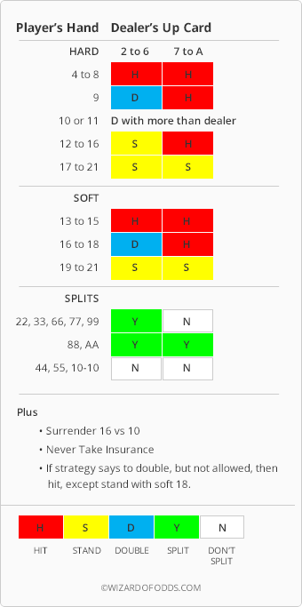

---
title: Wizard’s ace-five strategy
...

# Wizard’s ace-five strategy

> Difficulty: 30/100

So far the house always had the edge. it is now the turn for the player to be (a little bit) up. This Python player uses the Wizard of Odds’s  simple card-counting strategy called the Ace/Five count:^[<https://wizardofodds.com/games/blackjack/ace-five-count/>]

 1. Establish what your minimum and maximum bets will be. Usually the maximum will be 8, 16, or 32 times the minimum bet, or any power of 2, but you can use whatever bet spread you wish.
 2. At the beginning of each shoe, start with your minimum bet, and a count of zero.
 3. For each five observed, add one to the count.
 4. For each ace observed, subtract one from the count.
 5. If the count is greater than or equal to two, then double your last bet, up to your maximum bet.
 6. If the count is less than or equal to one, then make the minimum bet.
 7. Use basic strategy for all playing decisions.


Instead of using basic strategy, the player uses the Wizard’s simple strategy which is far easier to memorize (and to code):^[https://wizardofodds.com/games/blackjack/basics/#wizards-simple-strategy]
 
 * Always

   1. Hit hard 8 or less.
   2. Stand on hard 17 or more.
   3. Hit on soft 15 or less.
   4. Stand on soft 19 or more.
   5. With 10 or 11, double if you have more than the dealer’s up card (treating a dealer ace as 11 points), otherwise hit.
   6. Surrender 16 against 10.
   7. Split eights and aces. 

 * If the player hand does not fit one of the above "always" rules, and the dealer has a 2 to 6 up, then play as follows:

   1. Double on 9.
   2. Stand on hard 12 to 16.
   3. Double soft 16 to 18.
   4. Split 2’s, 3’s, 6’s, 7’s, and 9’s. 

 * If the player hand does not fit one of the above "always" rules, and the dealer has a 7 to A up, then hit. 

 



```
#!/usr/bin/python3

# plays the wizard's ace-five count
# <http://wizardofodds.com/games/blackjack/appendix/17/>
# with the simple strategy at
# <http://wizardofodds.com/games/blackjack/appendix/21/>
#
#
#  Player's hand     Dealer's upcard
# 
#  -- hard --------------------------------
#                    2 to 6     7 to A
#  4 to 8              H          H   
#  9                   D          H   
#  10 or 11        D with more than dealer
#  12 to 16            S          H
#  17 to 21            S          S
#
#  -- soft --------------------------------
#                    2 to 6     7 to A
#  13 to 15            H          H   
#  16 to 18            D          H   
#  19 to 21            S          S
#
#  -- split -------------------------------
#                    2 to 6     7 to A
#  22,33,66,77,99      Y          N   
#  88,AA               Y          Y   
#  44,55,TT            N          N
#
#  Plus:
#    1. surrender 16 vs 10
#    2. never take insurance
#    3. if not allowed to double, stand with soft 18
#

import sys 
import fileinput

max_bet = 8
debug = False

n_player_cards = 0
count = 0
bet = 1


for linenl in fileinput.input():
  line = linenl.rstrip()
  if debug:
    print("<- %s" % line, file = sys.stderr) 
  
  if line == "bye":
    sys.exit(0)
    
  elif line == "shuffling":
    count = 0
    bet = 1
        
  elif line[:8] == "new_hand": 
    n_player_cards = 0

  elif line == "insurance?": 
    print("no", flush = True)
    if debug:
      print("<- no", file = sys.stderr) 
        
  elif line == "bet?":
    if count <= 1:
      bet = 1
    elif bet < max_bet:
      bet *= 2
    print(bet, flush = True)
    #print("1", flush = True)
    
  elif line[:15] == "player_split_ok":    
    n_player_cards = 1

  elif line[:5] == "card_":
    tokens = line.split()
    if (6 > 1):
      card = tokens[1][0]
    else:
      card = ""   # the dealer's hole card
      
    # count aces and fives
    if card == "A":
      count -= 1
      if debug:
        print("ACE, count is %d" % count, file = sys.stderr) 
    elif card == "5":
      count += 1
      if debug:
        print("FIVE, count is %d" % count, file = sys.stderr) 

    if line[:11] == "card_player":
      n_player_cards += 1
      if n_player_cards == 1:
        card_player_first = card
      elif n_player_cards == 2:
        card_player_second = card
                      
  elif line[:5] == "play?":
    tokens = line.split()
    player = int(tokens[1])
    dealer = abs(int(tokens[2]))
    action = "quit"
    
    if n_player_cards == 2 and card_player_first == card_player_second and \
        ((card_player_first == "8" or card_player_first == "A") or \
         (dealer < 7 and \
            (card_player_first == "2" or \
             card_player_first == "3" or \
             card_player_first == "6" or \
             card_player_first == "7" or \
             card_player_first == "9"))):  # --- split------------------------------------
      action = "split"                     # always split aces and 8s but 2,3,6,7 & 9 only against 6 or less
      
    else:
      if player > 0:                       # --- hard ------------------------------------
        if player < 9:         
          action = "hit"                   # hit 4 to 8 against anything
        elif player == 9:
          if dealer < 7: 
            if n_player_cards == 2:
              action = "double"            # double 9 against 2 to 6
            else:
              action = "hit"               # else hit
          else:
            action = "hit"                 # hit 9 against 7 to A
        elif player < 12:
          if player > dealer:
            if n_player_cards == 2:
              action = "double"            # double with 10 or 11 and more than dealer
            else:
              action = "hit"
          else:
            action = "hit"                 # otherwise hit
        elif player < 17:
          if dealer < 7:
            action = "stand"               # stand with 12 to 16 against 2 to 6
          else:
            action = "hit"                 # hit with 12 to 16 against 7 to A
        else:
          action = "stand"                 # stand with hard 17 or more
      else:
        # soft
        player = abs(player)
        if player < 16:        
          action = "hit"                   # hit every soft hand less than 16
        elif player < 19:
          if dealer < 7:
            if n_player_cards == 2:
              action = "double"            # double soft 16 to 18 againt 2 to 6
            elif player == 18:
              action = "stand"             # stand with soft 18
            else:
              action = "hit"               # hit soft 17
          else:
            action = "hit"                 # hit soft 16 to 18 against 7 to A
        else:
          action = "stand"                 # stand with soft 19 or more
          
    print(action, flush = True)
    if debug:
      print("-> %s" % action, file = sys.stderr) 
    
  elif line == "invalid_command":
    print("I sent an invalid command!", file = sys.stderr) 
  


```

Of course there is a catch. Even though this strategy has a positive expectation in the long run, the betting spread adds a lot of dispersion to the results so the number of hands needed to get an uncertainty below the actual expected mean is very large. This, summed to the fact that we are using an interpreted language and a verbose dealer (the player needs to know which cards are being dealt so she can keep the ace/five count) over standard input and output means a few minutes to run. Also, note that counting cards make sense only when playing a shoe game, so a positive number of decks needs to be explicitly given.

```terminal
#!/bin/sh
if test -z "$1"; then n=1e5; else n=$1; fi; rm -f f;  mkfifo f;
cat f | blackjack --decks=1 --verbose=true -n${n} | python3 ace-five.py > f
```

In any case, here are the results:

```yaml
---
result: "(+0.5 ± 0.2) %"
mean: 0.00460405
error: 0.00196465
hands: 1e+07
bankroll: 46040.5
bustsPlayer: 0.156041
bustsDealer: 0.236745
wins: 0.444615
pushes: 0.0834705
losses: 0.489667
...

```

> **Exercise:** explore what the effect of the number of decks.


-------
:::{.text-center}
[Previous](../20-basic-strategy) | [Index](../) | [Next](../)
:::
